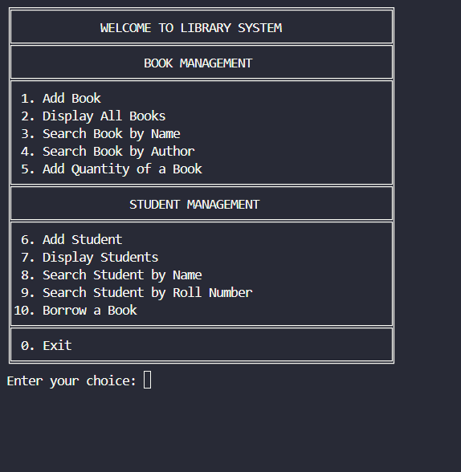

# 📚 Library Management System - Java Console Application

This is a simple **Library Management System** built using Java. It allows users to manage books and students, including features like adding books, searching, borrowing, and tracking borrowed books in a basic console-based environment.

---

## 🚀 Features

### 📘 Book Management
- Add new books
- Display all books
- Search books by name or author
- Update book quantity
- Borrow a book (quantity updates automatically)

### 🎓 Student Management
- Add a new student
- Display student details
- Search student by name or roll number
- Borrow a book (with quantity check)

---

## 💻 Technologies Used
- Java (Core Concepts)
- OOP (Object-Oriented Programming)
- Console-based input/output using `Scanner`
- Arrays for storing data

---

## 🏁 How to Run

1. Open the project in any Java IDE (e.g., IntelliJ, Eclipse).
2. Run `LibraryManagement.java` (main class).
3. Use the terminal menu to manage books and students.

---

## 👨‍💻 Author

- **Sam Preeth John**
- GitHub: [SamPreethJohn](https://github.com/SamPreethJohn)

---

## 📸 Screenshot (Optional)

Here’s how the console looks while running the project:

